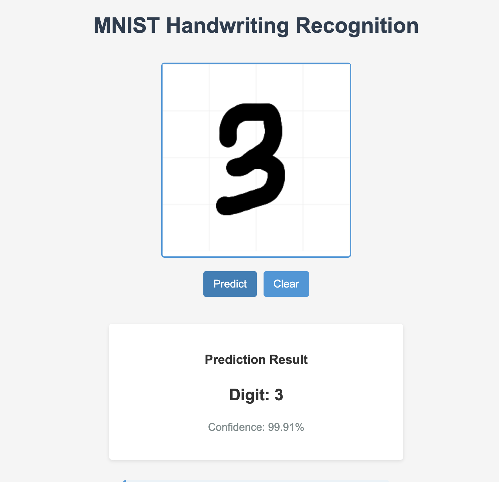

# Handwriting Digit Recognition Web App

A web application that recognizes handwritten digits using a Convolutional Neural Network (CNN) trained on the MNIST dataset. Users can draw digits on a canvas and get real-time predictions.



## Features

- Interactive drawing canvas
- Real-time digit recognition
- High accuracy CNN model
- Clean and intuitive user interface
- Production-ready deployment setup

## Requirements

- Python 3.8+
- Dependencies listed in requirements.txt

## Installation

1. Clone the repository:

```bash
git clone https://github.com/yourusername/handwriting-recognition.git
cd handwriting-recognition
```

2. Create a virtual environment (recommended):

```bash
python -m venv venv
source venv/bin/activate  # On Windows: venv\Scripts\activate
```

3. Install dependencies:

```bash
pip install -r requirements.txt
```

## Usage

1. Train the model (if not already trained):

```bash
python mnist_handwriting_recognition.py
```

2. Start the web server:

```bash
python app.py
```

3. Open your browser and navigate to:

```
http://localhost:8080
```

## Model Architecture

The CNN model consists of:

- 2 Convolutional layers with MaxPooling
- Dense layer with dropout for regularization
- Output layer for 10 digits
- Typically achieves 98-99% accuracy on MNIST test set

## Acknowledgments

- MNIST dataset from TensorFlow
- TensorFlow and Keras teams
- Flask web framework
